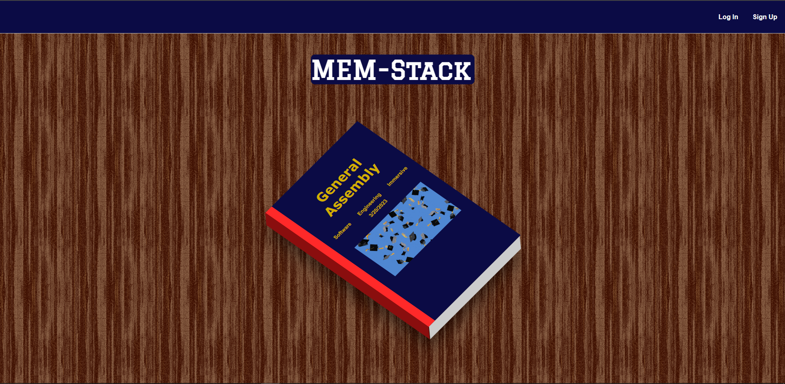

# MEM-Stack

## Overview

Welcome to the MEM-Stack Front-End repository! This repository contains the front-end code for the MEM-Stack application.

MEM-Stack is a project made as a farewell gift to the most challening and most rewarding thing I've ever done: General Assmebly's Software Engineering Immersive boot camp. This app, written in TypeScript and using a PostgreSQL database, allows users to register themselves as a student, and sign other students' virtual yearbooks. There is also a superlatives feature, which includes the results of a superlatives survey I sent out shortly before the end of the cohort. This app fills me with joy, melancholy, and excitement for what's to come for myself and every single student who took this class along with me. This one is for you guys as much as it is for me.

[Launch MEM-Stack](https://mem-stack.netlify.app/)

# Technologies Used

## BAAM Voyage was built using the following technologies:

- PostgreSQL
- Express
- React
- Node
- JWT authorization and authentication
- Supabase
- Cloudinary
- Fly.io
- Netlify
- Git
- Github

# Attributions:

- [Flaticon](https://www.flaticon.com/)

# IceBox 🧊

- [ ] Create your own class
- [ ] Dynamic Superlatives page

